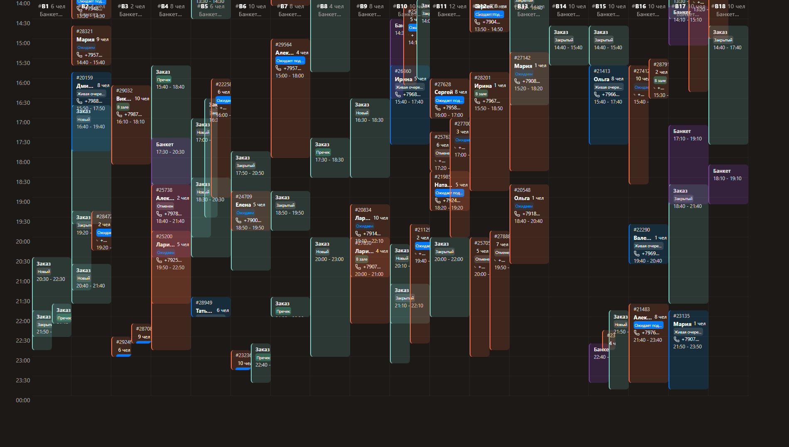

# Тестовое задание для Frontend разработчика в Ark Studio

## Описание проекта

Это приложение для просмотра бронирований в ресторане, разработанное как тестовое задание для Ark Studio. Приложение имитирует функциональность Airesto.ru - системы управления бронированиями для ресторанов.

## Функционал

- Просмотр бронирований по выбранной дате
- Фильтрация бронирований по зонам ресторана
- Отображение текущего времени ресторана
- Интерактивная таблица с фиксированными заголовками
- Эффекты наведения на события
- Оптимизированная производительность для мобильных устройств

## Технологии

- Next.js 15.4
- TypeScript
- Axios (для работы с API)
- Tailwind CSS (для стилизации)

## Демо

Рабочая версия приложения доступна по ссылке:
[Демо приложения](https://google.com)

## Screenshots

  

